# Database-MySQL-1
Database adalah kumpulan data yang terorganisir dan dapat diakses dengan mudah. Fundamental database MySQL untuk pengembangan web.

# Tugas 1: Eksplorasi Database dengan Query

## 1. Total Buku
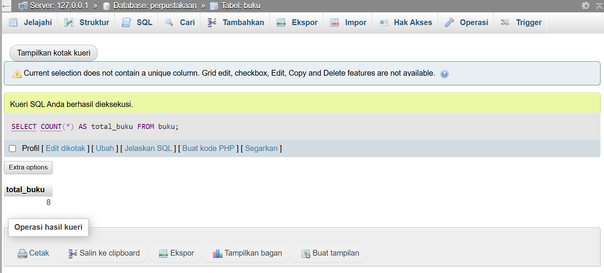

## 2. Total Inventaris

## 3. Rata-rata Harga Buku
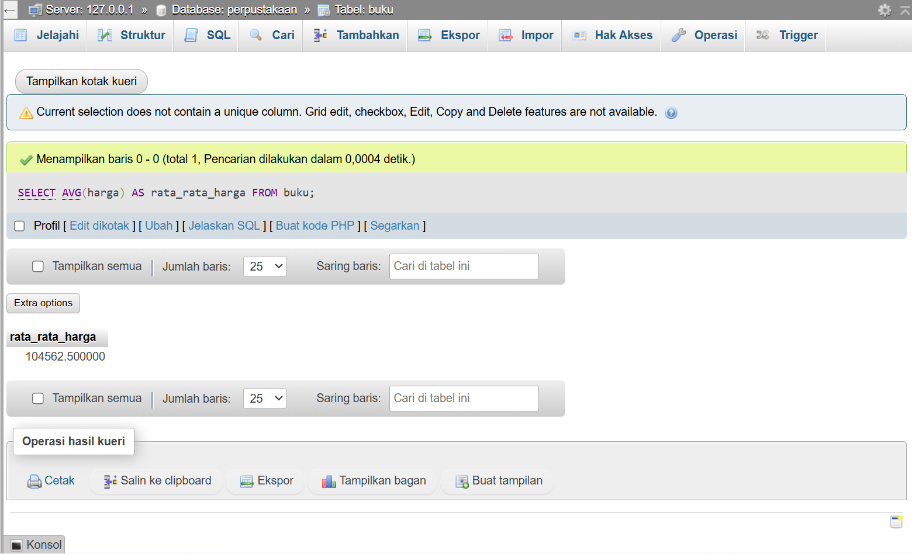

## 4. Buku Termahal
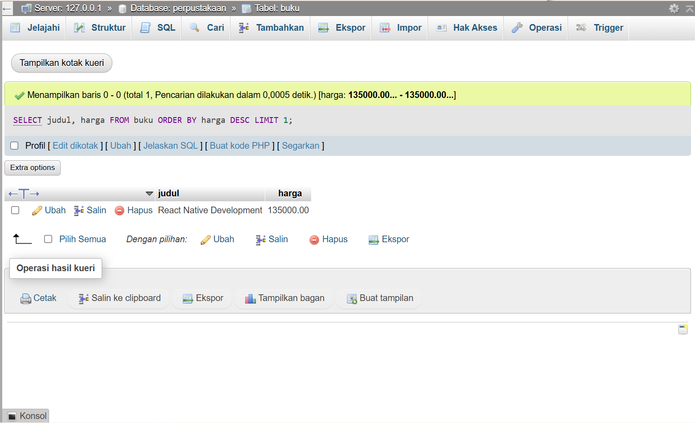

## 5. Stok Terbanyak
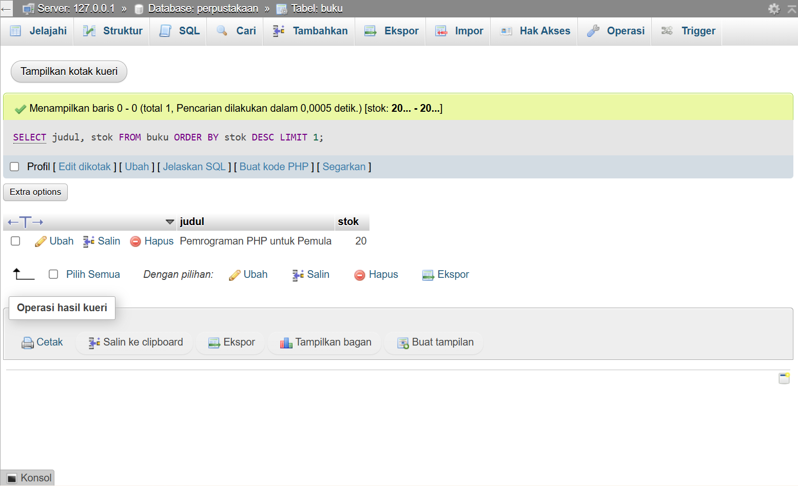

---

## 6. Buku Programming Harga < 100.000
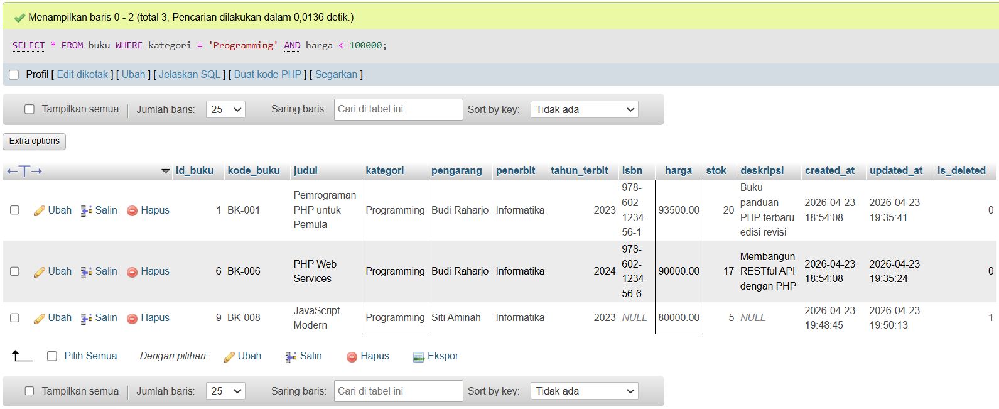

## 7. Judul Mengandung PHP atau MySQL
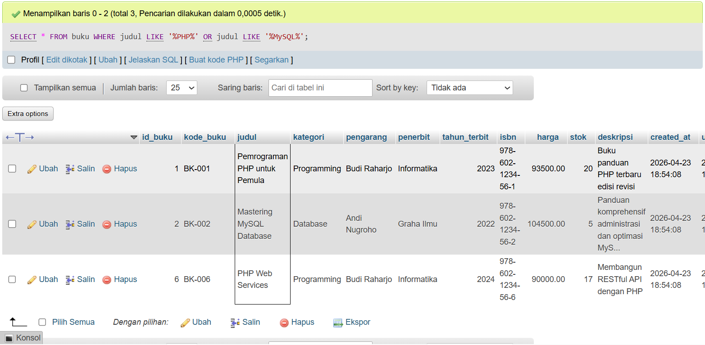

## 8. Buku Terbit Tahun 2024
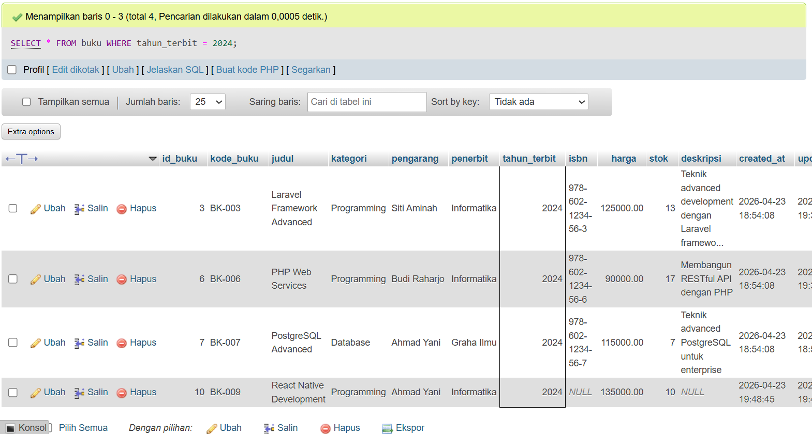

## 9. Buku Stok 5-10
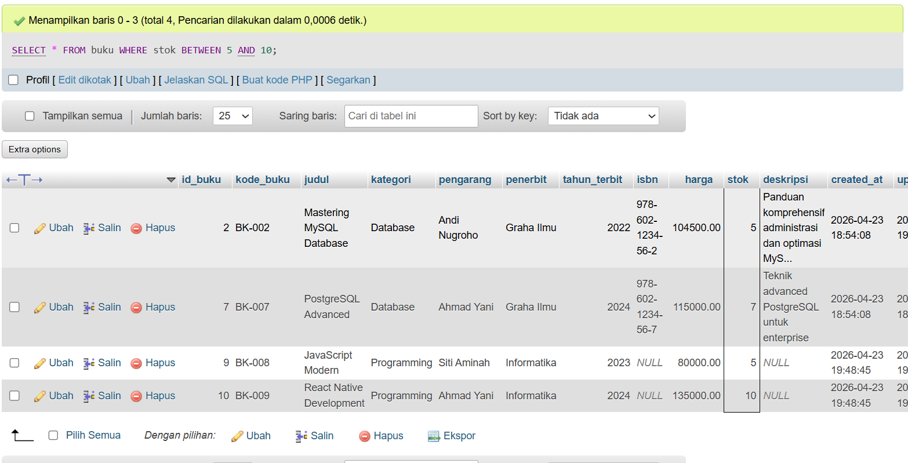

## 10. Pengarang Budi Raharjo
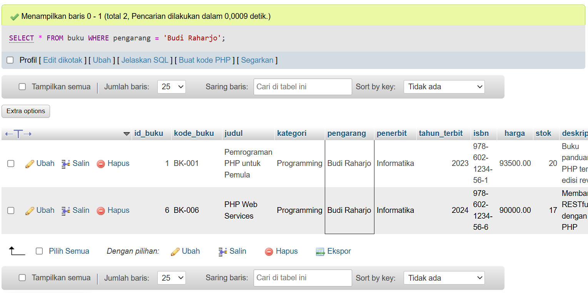

---

## 11. Jumlah Buku & Stok per Kategori
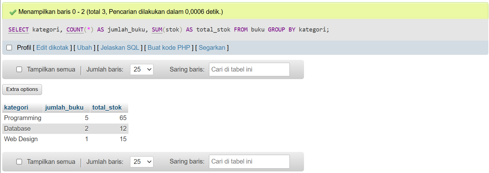

## 12. Rata-rata Harga per Kategori
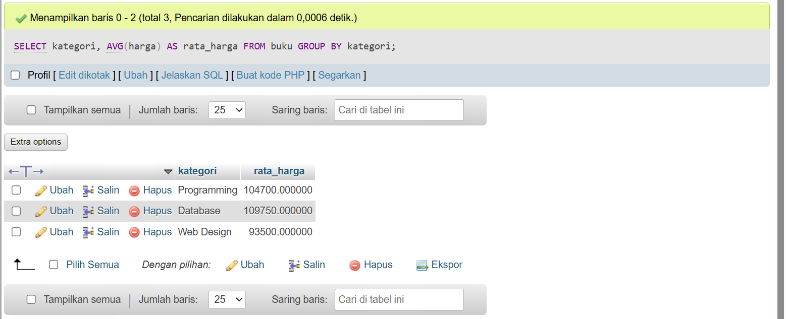

## 13. Nilai Inventaris Terbesar
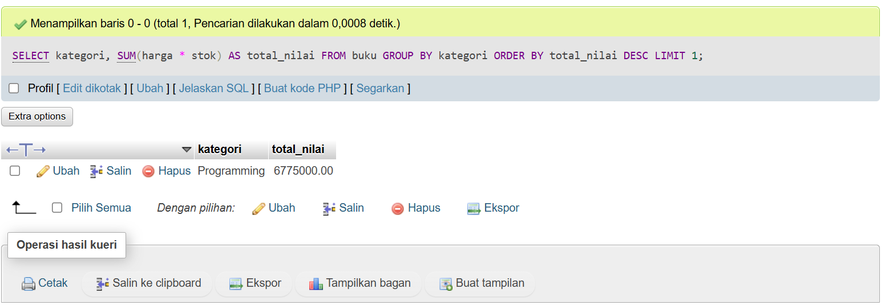

---

## 14. Update Harga Programming +5%
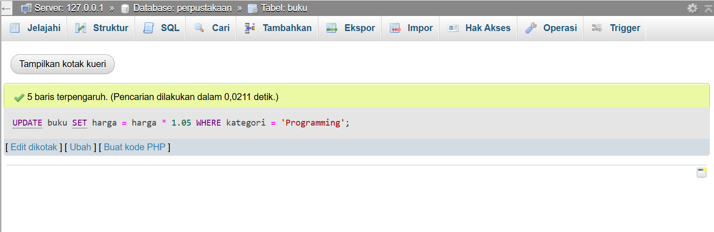

## 15. Update Stok (<5)
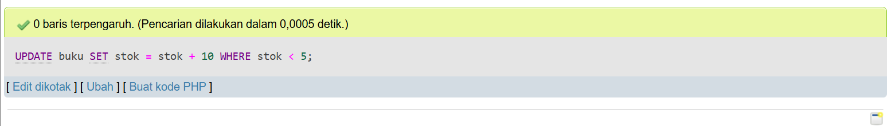

## 16. Hasil Update Harga
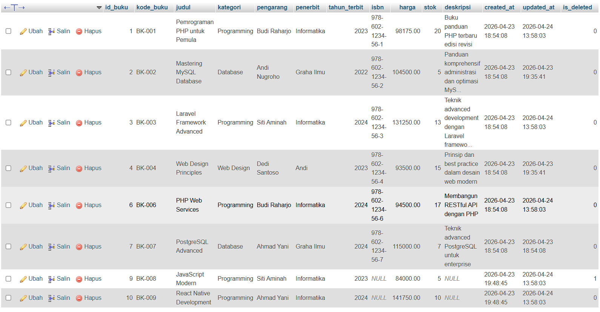

---

## 17. Buku Perlu Restock
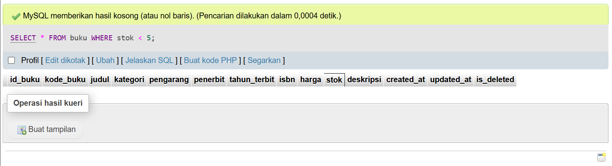

## 18. Top 5 Buku Termahal
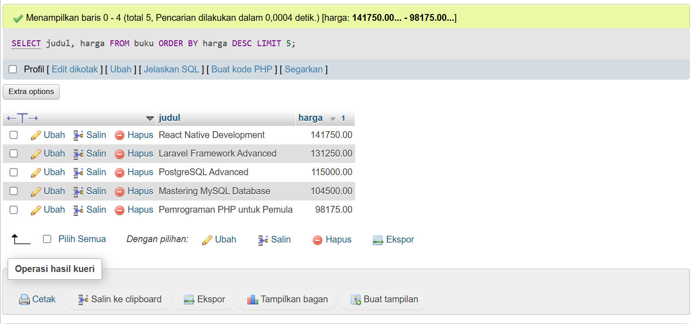
